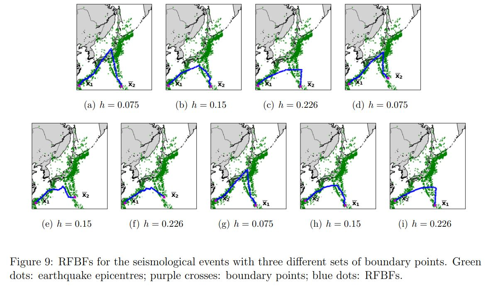
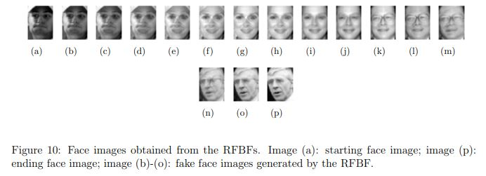

# Fixed Boundary Flow (FBF) Algorithm

This is a repository of random fixed boundary flows proposed in Yao, Z., Xia, Y. and Fan, Z. (2022). [Random Fixed Boundary Flows](https://arxiv.org/abs/1904.11332). arXiv: 1904.11332

## The FBF Algorithm
The FBF Algorithm obtains a discrete flow connecting the fixed boundary points `y0` and `y1` from the given manifold date in the ambient space. Each point of the flow moves along the direction of the local vector field, which is determined by the scale parameter `h`.

The core part of the algorithm is contained in the following four R source files. 
- [**add_functions.R**](<./RFBF functions/add_functions.R>) contains all the user-defined functions for the calculation. For example, finding local points in a given neighbourhood and computing the $k$-eigenvector.
- [**RFBF_fitting_function.R**](<./RFBF functions/RFBF_fitting_function.R>) contains the iterative algorithm to determine FBFs. This file is corresponding to steps 1 to 3 in *Algorithm 1* in the paper.
- [**RFBF_interpolation.R**](<./RFBF functions/RFBF_interpolation.R>) performs linear interpolation to the flow. This file is corresponding to step 4 in *Algorithm 1* in the paper.
- [**RFBF_smoothing.R**](<./RFBF functions/RFBF_smoothing.R>) performs local smoothing to the flow when necessary.

## Synthetic Data Studies
Two testing manifolds, unit sphere $S^2$ and a right-circular unit cone, have been investigated to study the performance of the FBF algorithm when analysing random data sets.

###  RFBFs on the unit sphere
We considered the following three types of population curves and used them to generate random data sets.
- [**sphere_c.csv**](<./data sets/sphere_c.csv>) contains a $C$-shaped population flow which presents a variation pattern along the geodesic.
- [**sphere_6fold.csv**](<./data sets/sphere_6fold.csv>) contains a quarter of the six-fold star-shaped flow.
- [**sphere_2fold.csv**](<./data sets/sphere_2fold.csv>) contains half of the two-fold star-shaped flow. 

The file [**Simulation Demo Sphere.R**](<./Simulation Demo Sphere.R>) generates the numeric results in Figures 5-6 and *Table 1*. The R file consists of two parts:
1. Generating random data sets using parameters `type`, `case` and `sd`. For example, we set `type="sphere"`, `case="c"` and `sd=0.015` to generate the noisy $C$-shaped data shown in *Figure 5(a)*.
2. Fitting the FBF using parameters `y0`, `y1`, `resolution`, `h`, `rho`, and `esp`.
For example, we set `y0=c(0.58676580, 0.03460339, 0.80901699)`, `y1=c(-0.3904378, 0.4393744, 0.8090170)`, `resolution=20`, `h=0.08`, `rho=0.95`, `eps=0.01` and obtained the flow plotted in *Figure 5(d)*. In *Figures 5-6*, we visualise the FBFs in the ambient space using R package <span style="color: red;">`rgl`</span>. To obtain the mean errors in *Table 1*, we generated 10 random data sets for each population flow and run the FBF algorithm with different values of `h`.

### RFBFs on a right-circular unit cone
We considered the following three types of population curves on a right-circular unit cone with apex at $(0, 0, 0)$, height `H = 1`, and radius `R = 1`. Then, we generated random data sets using these population flows.
- [**cone_c.csv**](<./data sets/cone_c.csv>) contains a $C$-shaped population flow on the cone.
- [**cone_s_short.csv**](<./data sets/cone_s_short.csv>) contains half of the $S$-shaped population flow.
- [**cone_s_long.csv**](<./data sets/cone_s_long.csv>) contains a $S$-shaped population flow.

The file [**Simulation Demo Cone.R**](<./Simulation Demo Cone.R>) generates the numeric results in *Figures 7* and *Table 1*. The R file consists of two parts:

1. Generating random data sets using parameters `type`, `case`, `sd`, `R` and `H`. For example, we set `type="cone"`, `case="c"`, `sd=0.015`, `R=1` and `H=1` to generate the noisy band data set shown in *Figure 7(a)*.
2. Fitting the FBF using parameters `y0`, `y1`, `resolution`, `h`, `rho`, and `esp`. For example, we set `y0=c(-0.4194, -0.1886, 0.4598)`, `y1=c(-0.2875, -0.6366, 0.6986)`, `resolution=30`, `h=0.14`, `rho=0.95`, `eps=0.01` and obtained the flow plotted in <span style="color: red;">red</span> in *Figure 7(a)*.


In *Figures 7(a)-(c)*, we visualise the FBFs in the ambient space using R package <span style="color: red;">`rgl`</span>. To obtain the mean errors in *Table 1*, we generated 10 random data sets for each population flow and run the FBF algorithm with different values of `h`.

### *Figure 5(f)* Example
To get the FBF in *Figure 5(f)*, we use the code from [**Simulation Demo Sphere.R**](<./Simulation Demo Sphere.R>).

<center></center>

#### Step 1: Generate the random data
```R
# example begins here
type = "sphere"

case = "2fold" #  "6fold" # "c" #

sd <- 0.015

showcase = paste(type,"_",case,sep="")

if(showcase=="sphere_c"){
  # population flow
  pure_curve = data.matrix(read.csv("./data sets/sphere_c.csv", header=FALSE))
  # set boundary points
  y0 <- c(0.58676580, 0.03460339, 0.80901699)
  y1 <- c(-0.3904378,  0.4393744,  0.8090170)
  # set RFBF parameters 
  resolution <- 20
  h <- 0.14 
  rho <- 0.95
  eps <- 1e-2
}else if(showcase=="sphere_6fold"){
  # population flow
  pure_curve = data.matrix(read.csv("./data sets/sphere_6fold.csv",
                                    header=FALSE))
  # set boundary points
  y0 <- c(-0.011409,  0.594140,  0.804280)
  y1 <- c(-0.593770,  0.012112,  0.804540)
  # set RFBF parameters 
  resolution <- 40
  h <- 0.08
  rho <- 0.95
  eps <- 1e-2
}else if(showcase=="sphere_2fold"){
  # population flow
  pure_curve = data.matrix(read.csv("./data sets/sphere_2fold.csv", 
                                    header=FALSE))
  # set boundary points
  y0 <- c(0.37931, 0.46014, 0.80274)
  y1 <- c(-0.46192, -0.37645,  0.80307)
  # set RFBF parameters 
  resolution <- 30
  h <- 0.08
  rho <- 0.95
  eps <- 1e-2
}

n = ncol(pure_curve)

## generate noisy data 

weighted_noise = FALSE
manifoldata <- NULL

if (weighted_noise==TRUE){
  weight <- abs(c(1:n)-(n+1)/2)
  
  weight <- ceiling(max(weight))-weight
  
  weight <- (weight-floor(min(weight)))/(ceiling(max(weight))-
                                           floor(min(weight)))
  
  
  weight[which(weight<=0.3)] <- 0.3
  
  weight[which(weight>=0.6)] <- 0.6
}else{
  weight = rep(1,n)
}


for (i in 1:n){
  noisy1 <- pure_curve[1,i]+weight[i]*rnorm(1,0,sd)
  
  noisy2 <- pure_curve[2,i]+weight[i]*rnorm(1,0,sd)
  
  noisy3 <- pure_curve[3,i]
  
  noisy <- rbind(noisy1,noisy2,noisy3)
  
  noisy <- apply(noisy,2,function(x){x/norm2(x)})
  
  manifoldata <- cbind(manifoldata,noisy)
  
}
```

#### Step 2: Fit the FBF using the code from 
```R
# RFBF algorithm begins here

## initial curve 
gamma_ini <- gamma_given(resolution,y0,y1,1)

## Fitting RFBF 
sol <- RFBF_fitting(gamma_ini, manifoldata, y0,y1,h,rho)

sol <- apply(sol,2,function(x)x/norm2(x))


## smoothing the flow 
h_smoothing = h

sol_smoothing = FBF_smoothing(sol,h_smoothing)

## interpolation for the flow  
dist_ini = norm2(gamma_ini[,2]-gamma_ini[,3])

curve_fbf = FBF_interpolation(sol_smoothing,dist_ini)


## plot the result in 3D
open3d()
spheres3d(c(0,0,0),radius = 1,color="yellow",alpha=1)
points3d(manifoldata[1,],manifoldata[2,],manifoldata[3,],alpha=0.9)
rgl.spheres(curve_fbf[1,],curve_fbf[2,],curve_fbf[3,], r = 0.005, color = "red")  
```

## Real Data Applications
### Seismological Data
In our analysis, we considered the epicenters of the earthquake data and scaled the latitude/longitude of the epicenter to Cartesian coordinates in $\mathbb{R}^3$. The Cartesian coordinates of the earthquake data are contained in columns 2 to 4 of the [**seismology cartesian.csv**](<./data sets/seismology cartesian.csv>) file. 

The [**RFBF Seismology Demo.R**](<./RFBF Seismology Demo.R>) file generates the results in *Figure 9*. As shown in *Figure 9*, we considered 3 different sets of boundary points, namely (a)-(c), (d)-(f) and (g)-(i). For each set of boundary points, we fitted FBF with 3 different values of `h`. For example, if we let `set_idx=1`, `h_idx=2`, `resolution=30`, `rho=1` and `eps=0.01`, we will obtain the FBF shown in blue in *Figure 9(b)*.

<center></center>

### Labeled Faces in the Wild
The image data set used in the analysis contains 264 face images of 66 people, with four images of each person. Each image has been resized to $50 \times 37$ pixels and becomes a vector in $\mathbb{R}^{1850}$. The [**image_faces_33by2by4.csv**](<./data sets/image_faces_33by2by4.csv>) file contains the image data with columns representing the features in $\mathbb{R}^{1850}$. 

The [**RFBF Image Demo.R**](<./RFBF Image Demo.R>) file shows the FBF fitting from the image data set with specified boundary points. The images plotted in *Figure 10* are constructed using [**face_img_plot.py**](<./face_img_plot.py>) in Python.

<center></center>